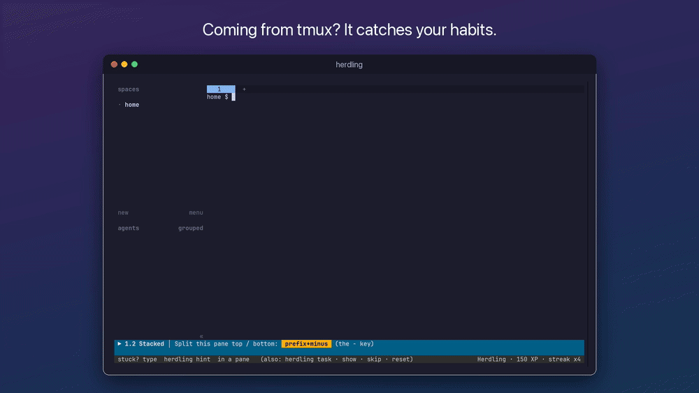

# herdling

[](https://github.com/speedballjamm/herdling/actions/workflows/tests.yml)
[](LICENSE)

Learn [Herdr](https://herdr.dev) by playing it. No prior knowledge needed.



You play inside a **real Herdr**, and the game watches what you do. Your mission shows in
a bar under Herdr. Press the right keys (or click the right things) and you clear it,
earning XP, stars and ranks. Everything you learn works in any stock Herdr.

## Install

```
brew install speedballjamm/tap/herdling
```

or, without Homebrew (macOS and Linux):

```
curl -fsSL https://raw.githubusercontent.com/speedballjamm/herdling/main/install.sh | sh
```

or just clone this repo and run `./herdling`. Then:

```
herdling
```

## Requirements

- Herdr 0.9 or newer (`curl -fsSL https://herdr.dev/install.sh | sh`, or `brew install herdr`)
- Python 3.9+ (the one that ships with macOS is fine). No packages to install.
- A terminal of at least 80×24. 110×32 or bigger is nicer.

Run it from a plain terminal: not from inside Herdr (Herdr refuses to nest), and ideally
not from inside tmux (tmux eats `ctrl+b`).

## What's in it

| | |
|---|---|
| **Campaign** | 11 worlds, 61 missions: the prefix and the mouse, panes, pane power (zoom, resize mode, swap, sidebar), tabs, workspaces (navigate mode, goto), **agents** (blocked / working / done, notifications, `prefix+o`), detach and named sessions, copy mode, the `herdr` CLI, config.toml, and a final boss. |
| **Dojo** | 60-second speed drills with combos. Beat your high score. |
| **Review** | Spaced repetition: keys you fumbled come back sooner. |
| **Sandbox** | Free play. The bar names every key you press and what it did. |
| **Cheat sheet** | `herdling cheat` (or `herdling cheat --all`). |

Coming from tmux? The game notices tmux habits (`prefix+%`, `prefix+"`, `prefix+d`,
prefix+arrows…) and tells you the Herdr key instead.

## While playing

Type these in any shell pane inside the game:

```
herdling task      reprint the task here          herdling card     re-open the lesson card
herdling hint      a hint (the first is free)     herdling reset    set the step up again
herdling show      watch it done, then try        herdling edit     open your practice config
herdling skip      skip this mission              herdling menu     back to the title screen
```

When you detach (`prefix+q`) you land on a practice prompt that runs real Herdr
commands: `herdr`, `herdr session list`, `herdr session attach work`, and so on.

## Safety

The game runs its own Herdr in a sandbox (`XDG_CONFIG_HOME=~/.herdling/x`), so it can't
see or touch your own Herdr sessions, and your shells inside the game still see your
normal config. Progress lives in `~/.herdling/`. The only other file it ever writes is
`~/.config/herdr/config.toml`, and only if you run `herdling install` and say yes (any
existing file is backed up first).

The copy-and-paste missions use your system clipboard, like Herdr itself does.

## Mac notes

- **Option as Alt** (only for the bonus `ctrl+alt+z` mission): in Terminal.app, go to
  Settings → Profiles → Keyboard → "Use Option as Meta key". In iTerm2, Profiles → Keys →
  Left Option key → Esc+.

## Support

herdling is free and always will be. If it saved you an afternoon of reading docs:

- Star the repo, and tell a friend who's drowning in agent terminals
- [Sponsor on GitHub](https://github.com/sponsors/speedballjamm)
- [Report a problem](https://github.com/speedballjamm/herdling/issues): Herdr moves fast, and bug reports keep the missions working

herdling is an independent fan project, not affiliated with Herdr, Inc.

## Development

```
python3 -m unittest tests/test_units.py     # fast, no Herdr
python3 tests/test_missions.py              # plays every mission with real keystrokes (~70s, parallel)
python3 tests/test_modes.py                 # sandbox, dojo, review, hints, show, skip, menu, detach…
```

The design is in [SPEC.md](SPEC.md). Missions are data in `game/worlds/`. Each step has
a setup, a goal function over a snapshot of Herdr's state, hints, and mistake detectors.

The demo (`docs/demo.gif`, `docs/demo.mp4`) and `docs/social-preview.png` are recorded from real play
by `python3 docs/demo/record.py`. See the top of that file for what it needs.

MIT licensed. See [LICENSE](LICENSE).
